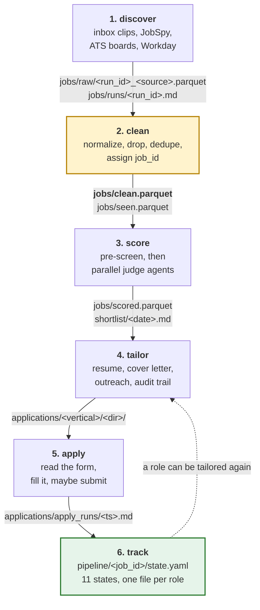

# ApplYourself

A job-search pipeline you run yourself, on your own machine, over your own
resume. It scrapes postings, scores them against a profile you write, drafts
tailored resumes and cover letters, and can fill and submit an application form
for you, with you in the loop at every point that matters.

**It's for you if** you are applying to a lot of roles across a few different
kinds of job, you want the sifting automated but the writing to still sound like
you, and you are comfortable running things from a terminal.

**It's not for you if** you want a hosted service, a web UI, or something that
applies to hundreds of jobs while you sleep. This is a repo you clone, a profile
you fill in by hand, and a set of commands you run when you decide to.

It needs [Claude Code](https://claude.com/claude-code), because the slash commands
are where the scoring, the writing and every judgment call actually happen.

## What it writes, and what it sends

Everything this repo produces lands on your disk. Outreach messages and cover
letters are **written to files and nothing more**. Nothing here emails, DMs,
or posts anywhere.

Application *submission* is the one exception. `/apply` drives a real Chrome
(Playwright) and can fill and submit an employer's form. It is opt-in per run:
the default fills and stops, and only `apply run --submit` presses submit. It
lists the roles first and asks you to type a confirmation, unless `--yes` is
passed. Submission works on **Greenhouse, Lever and Ashby only**. Workday,
LinkedIn, Indeed and company careers pages are always manual-apply. They get
discovered and scored like anything else, and never submitted to.

> **Two things to know before you use `--submit`.**
>
> **The typed confirmation can be skipped.** `/apply` always passes `--yes`,
> because its own Step 6b is meant to be the confirmation, and that step is
> skipped when the form needed no drafted answers. For a role whose form is
> entirely standard fields, `/apply <job_id> --submit` submits for real with no
> second prompt.
>
> **Filling is not a dry run.** A fill uploads your resume and cover letter to
> the ATS before any submit decision is made. `apply fill` and a default
> `apply run` both leave files on the employer's server. They just don't press
> the button.

It is sponsorship-aware throughout. The scoring pre-screen skips postings that
state a hard ineligibility, and the outreach drafts have per-channel rules for
when to raise work authorization.

## The pipeline

Six stages. Each one writes a file, and the next one reads it, so you can stop
anywhere, look at what happened, and pick up later.



`jobs/clean.parquet` is the **only** discovery output anything downstream reads.
Cleaning runs automatically at the end of every discovery run, in a fixed order:

1. Title gate: classify each row into a lane; unclassified rows are dropped
2. Normalize company and title
3. Drop postings whose description is under 200 characters
4. Drop postings older than 14 days (career-board sources are exempt)
5. Drop postings outside your location allowlist
6. Dedupe exactly, on `(company_normalized, title_normalized)`. The longest
   description wins
7. Dedupe fuzzily, within a company, at `rapidfuzz.WRatio >= 90` **and**
   matching seniority tokens, so "Senior Engineer" never merges into "Engineer"
8. Assign `job_id`
9. Update the seen-ledger, check for tracked roles, mark expiries, default the
   scoring columns

Every near-duplicate it drops is named in `jobs/runs/<run_id>.md`. That's the one
quiet way a role you were tracking can leave `clean.parquet`.

Scoring puts a keeper list in `shortlist/<date>.md`: the top 25 per lane, minimum
fit 50, and **each lane ranks independently**. A score in one lane is never
compared to a score in another.

## Lanes ("verticals")

A **vertical** is a job lane, one distinct kind of role you're pursuing. Say
you're open to two quite different jobs. Each lane gets its own search terms,
title classifier rules, disqualifiers, scoring rubric, tailoring defaults, and
the resume it gets judged against. A posting is classified into exactly one lane
at fetch time, scored against that lane's rubric, and tailored from that lane's
resume.

Lanes are **pure config**. `src/` hardcodes no lane, no search term, no company.

Run `/new-vertical` to add one. It's quick mode: it drafts the block the loader
requires, one classifier rule, the rubric, the tailoring defaults and the lane's
resume, then asks a single confirm-or-edit. `/tune-vertical <name>` is the deep
pass afterwards, once you've seen real postings in the lane.

<details>
<summary><b>The vertical config schema</b></summary>

Config lives in `profile/verticals.yaml` (gitignored user data), with a matching
`profile/verticals/<name>/` directory holding `rubric.md` and `tailoring.md`,
plus the resume that block's required `resume_file` points at.
`profile/verticals.example.yaml` documents every field, and
`profile/verticals/example_*/` show the per-lane files.

- Vertical names must match `^[a-z][a-z0-9_]*$`, because they become parquet
  values, `applications/<name>/` directories, and staging-file suffixes.
- Mapping order under `verticals:` sets shortlist section order. First is primary.
- `classifier_rules` order is the ambiguity policy: first match wins. One lane
  may own several rules at different priorities.
- `disqualifier` supports title phrases, JD phrases, and a `max_years` ceiling.
  Priority when several hit: title, then phrase, then years.
- `title_include_terms` is an optional include-gate for when a board fuzzy-matches
  your search terms into hundreds of off-lane titles a blocklist can't keep up
  with. Off by default.
- `skill_weights` are 0-10 integers, consumed by the judges, opaque to `src/`.
- `salary_expectation` is read only by `/apply`, only for lanes that set it.

`src/verticals.py` is the single loader and it is **strict**: a vertical block
missing any required key raises `ValueError`. Because `tests/conftest.py` injects
config through an autouse fixture, one malformed block errors the entire test
suite. `uv run verticals-check` fails loud if a rubric, tailoring file or resume
is missing.

</details>

<details>
<summary><b>Adding a lane by hand (the four renames it needs)</b></summary>

`/new-vertical` exists because copying `profile/verticals/example_primary/` is
not enough on its own. The copied directory stays unreferenced until you also
change, in `profile/verticals.yaml`:

1. the block key
2. its `display_name`
3. its `resume_file`, which still points at the original
4. the `vertical:` values in `classifier_rules`

Miss any of those and `verticals-check` still passes while your lane does
nothing.

</details>

## Start here

You need [uv](https://docs.astral.sh/uv/), Python 3.12 (pinned `>=3.12,<3.13`),
and Claude Code. PDF output additionally needs Microsoft Word on macOS, which
it drives via `osascript`. Everything else runs anywhere Python does; without Word
you get the `.docx` and convert it yourself.

**1. Install and prove the clone works.** The core install needs no C toolchain.

```bash
git clone <this repo> && cd <repo>
uv sync
uv run pytest tests -q --ignore=tests/discovery   # should be fully green
```

**2. Install libpostal.** The location filter in cleaning needs the system
**libpostal** C library and its Python binding, with no fallback parser, and
every ingestion path runs cleaning — including the scrape `/onboarding` does at
its step 1. This is the one genuinely annoying install.

```bash
brew install libpostal            # macOS. On Linux, build from source first.
uv sync --group discovery
uv run python -c "import postal.parser"   # must exit 0
uv run pytest tests -q            # the discovery tests can run now too
```

**3. Fill in your profile.** In Claude Code:

```
/onboarding
```

Five steps, about 21 minutes, eight questions instead of the 33 decisions the
by-hand path asks for: the roles you want, your work authorization, an
experience cap, a target level and one confirm-or-edit on your first lane, two
on what it inferred, and one against real scored postings, which are on screen
by minute 17. The scrape starts while it reads your resume, and the scoring runs while you
answer the review questions. It drafts every `profile/` file for you, showing
you only the handful of lines it had to interpret. It's
resumable: stop after any step and re-run to continue, or `/onboarding step <n>`
to jump.

Already set up and want a health check? `/onboarding audit` reports what's
missing or invalid and changes nothing. Prefer to do it by hand?
`uv run onboard-scaffold --vertical <lane> --work-auth <status>` does the
mechanical half — every `profile/*.example.*` copied to its real name, the
example lanes stripped out of `verticals.yaml`, `sponsorship_rules.yaml`
reconciled — and leaves the writing to you. It leaves `verticals.yaml`
without a lane, so it won't load until `/new-vertical <lane>` writes one. See
[What only you can supply](#what-only-you-can-supply).

**4. Check your config loads.**

```bash
uv run verticals-check     # prints your lanes, or fails with what's missing
```

**5. Get more jobs in.** Either scrape overnight, or start with a single
posting:

```bash
uv run discover                                  # the full run
uv run ingest-url <a job posting URL>            # or just one
```

In Claude Code, `/ingest <url> <vertical> resume cover-letter` runs the whole
chain on one posting (ingest, score, tailor, letter) and stops before
applying.

**6. Score, then tailor.** In Claude Code:

```
/score                    # writes shortlist/<date>.md
/tailor <job_id>          # resume + audit trail for one role
/cover-letter <job_id>    # when the board wants a letter
/apply <job_id>           # fills the form; submits only if you say so
/track <job_id> applied   # you, or /apply, moving the role forward
```

Read the shortlist before you tailor. It's the whole point of the scoring stage.
`/apply` needs one more install, and Linux needs a longer libpostal story. Both
are in the block below.

<details>
<summary><b>Extra installs: Linux libpostal, and the `/apply` browser</b></summary>

**libpostal on Linux.** No distro packages it. Build from source
([openvenues/libpostal](https://github.com/openvenues/libpostal)) and budget for
it: the build downloads roughly 2GB of model data, and the development headers
must be present for the `postal` Python binding to compile. Needs
`autoconf`, `automake`, `libtool`, `pkgconf` and a compiler. If you used a
non-default `--prefix`, export `LIBPOSTAL_PREFIX` and `LD_LIBRARY_PATH`. See the
CI workflow in `.github/workflows/ci.yml` for a working recipe.

**The `/apply` browser.** An opt-in group that needs a Chrome to drive. Every
other stage works on a clone that never installs it.

```bash
uv sync --group apply
PLAYWRIGHT_SKIP_BROWSER_DOWNLOAD=1 uv run playwright install chrome   # macOS
```

It drives a separate, empty Chrome profile at `.apply_profile/`, never your own
browser session.

</details>

<details>
<summary><b>Running discovery nightly (macOS)</b></summary>

`scripts/nightly_discovery.sh` plus `scripts/launchagent.example.plist` schedule
the scrape at 22:30, wrapped in `caffeinate` so sleep doesn't kill it mid-run. A
`launchd` job whose start time falls while the Mac is asleep is skipped rather
than deferred, so it needs a `pmset` wake a few minutes earlier. `/onboarding`
prints the install block for you at the end.

Scoring deliberately stays a morning decision, since it needs a Claude Code
session.

</details>

## Commands

The slash commands are the product. `src/` on its own is a scraper, a docx
renderer and a form filler; Claude Code runs the half that decides things.

**Read a command's `.md` before running it.** The real orchestration logic lives
in `.claude/commands/`, not in `src/`.

### Slash commands

| command | what it does | writes |
|---|---|---|
| `/onboarding` | Five-step resumable setup: eight questions, ~21 minutes, real scored jobs at step 4. Also runs as an audit (`/onboarding audit`). | every `profile/` file, `profile/.onboarding.md` |
| `/score` | Score new rows and regenerate today's shortlist. Fans out one judge agent per lane range. Takes no arguments. | `jobs/scored.parquet`, `shortlist/<date>.md` |
| `/rescore` | Throw away every judgment and re-judge the whole 14-day window. Explicit only. | same, after deleting `jobs/scored.parquet` |
| `/tailor <job_id>` | One-page ATS-clean tailored resume, plus the audit trail behind it. | `applications/<vertical>/<dir>/`: `_Resume.docx`, `_Resume.pdf`, `resume.md`, `trace.md`, `keywords_to_mirror.md`, `jd_snapshot.md`, `lint_report.md` |
| `/cover-letter <job_id>` | One-page letter into that role's latest `/tailor` dir. | `_Cover_Letter.docx`, `_Cover_Letter.pdf` |
| `/company-answers <job_id>` | Research the company and draft its answer sheet. No letter. | `company_answers.md` in the `/tailor` dir |
| `/apply <job_id> [--submit]` | Resolve the judgment-only form questions, then fill, or submit. | `answers_override.json`, `applications/apply_runs/<ts>.md` |
| `/outreach <job_id> <channel> --to "Name"` | Draft a recruiter, referral or alumni message in your voice. Never sends. | `pipeline/<job_id>/outreach/<date>_<channel>_<who>.md` |
| `/track <job_id> <state>` | Move a role through the state machine. The **only** writer of state. | `pipeline/<job_id>/state.yaml` |
| `/standup` | Rebuild the whole-pipeline view. Read-only on state. | `pipeline.md` |
| `/ingest <url> <vertical> [resume] [cover-letter]` | Single-URL fast path: ingest, score one row, tailor, letter. Stops before applying. | everything the chained commands write |
| `/new-vertical <name>` | Quick-add a lane as pure config: the loader's minimum, one confirm-or-edit. | `profile/verticals.yaml` block + `profile/verticals/<name>/` |
| `/tune-vertical <name>` | Deep tuning pass on a lane that already exists, against rows you've seen: search terms, `skill_weights`, the title gate, classifier collisions, disqualifiers, rubric tiers, `vertical_lean`. | the same two, edited in place |
| `/suggest-synonyms` | Three-track audit of your bullets and skills against real shortlist keywords. Proposes, never edits. | `profile/synonyms_draft_<date>.md` |
| `/no_ai_slop` | Editor pass: sharpen a draft, or name its AI-slop patterns without rewriting. | nothing; returns the edit in conversation |

The judge is a subagent, not a command: `.claude/agents/score-judge.md`, spawned
per row-range by `/score`, `/rescore` and `/ingest`. Never invoke it directly.

### Deterministic CLIs

Every entry point in `pyproject.toml [project.scripts]`. These never call an LLM.

| command | what it does | writes |
|---|---|---|
| `uv run discover [--resume <run_id>]` | Overnight scrape, then cleaning. Needs `--group discovery`. | `jobs/raw/<run_id>_<source>.parquet`, `jobs/runs/<run_id>.md`, then cleaning's output |
| `uv run ingest-url <url> [--vertical V] [--company C] [--title T] [--dry-run]` | One posting into the pipeline, then a full clean rebuild. Needs `--group discovery`. | `jobs/raw/<run_id>.parquet`, `jobs/clean.parquet` |
| `uv run verticals-check` | Validate config plus every per-lane rubric, tailoring file and resume. | nothing |
| `uv run onboard-scaffold --vertical V --work-auth citizen\|needs_now\|time_limited [--with-apply] [--with-optional] [--force] [--dry-run]` | Every mechanical setup chore: copy each `profile/*.example.*` to its real name, strip the example lanes from the copied `verticals.yaml` and set `default_vertical`, reconcile `sponsorship_rules.yaml`, probe for libpostal. `--with-apply` installs the apply dependency group and Playwright's Chrome. Skips any file that already exists unless `--force`. | the copied `profile/` files |
| `uv run score <subcommand>` | `/score`'s plumbing: `prepare`, `dump`, `split`, `ranges`, `check-coverage`, `merge`, `render`. | `jobs/scored.staging/*`, `jobs/scored.parquet`, `shortlist/<date>.md` |
| `uv run track <job_id> <state> [--note ...]` | One state transition. Also `ensure <job_id>` and `outreach-sent`. | `pipeline/<job_id>/state.yaml` |
| `uv run tailor-prep <job_id>` | `/tailor`'s front matter: prereqs, row load, output dir. Also `identity` and `snapshot`. | `/tmp/tailor_<job_id>_row.json`, the `applications/` output dir |
| `uv run profile-extract <file>` | Dump a `.docx` or `.md` resume's text. Refuses `.pdf`. | nothing; prints to stdout |
| `uv run apply <subcommand>` | `prepare`, `plan`, `fill`, `run`. Needs `--group apply`. | see below |

Plus two scripts: `./scripts/pii_scan.sh` (the
[PII gate](#before-you-push-the-pii-gate)) and
`uv run python scripts/scrub_example_templates.py` (strips Word metadata from
the two tracked `.docx`).

<details>
<summary><b>What each <code>apply</code> subcommand actually does</b></summary>

| subcommand | behavior |
|---|---|
| `prepare <job_id>` | Validate prereqs, resolve the output dir, vertical and answers file. Requires state `saved` or `tailored` with a non-empty `tailored_dirs[]`. Resets `answers_override.json`. |
| `plan <job_id> [--json]` | Print the fill plan. Writes nothing, opens no browser, except Ashby, whose form is client-rendered, so one headless page load fetches the field description text its API doesn't return. |
| `fill <job_id>` | Fill one real form and stop. **Uploads your documents.** Never submits. |
| `run [--limit N] [--rate 4m] [--jitter 60s] [--job-id ID] [--submit] [--yes]` | Walk the eligible queue: roles in state `tailored` with a resume on file. |

The submit path is bounded in four ways, all in `src/apply_cli.py`:

- `--submit` is off by default and is the only thing that presses submit.
- `apply run --submit` requires an explicit `--limit`, unless `--job-id` names
  one role. It errors before any browser opens.
- It prints the roles it's about to apply to and requires a typed confirmation
  unless `--yes`. A non-tty stdin without `--yes` is **refused**, never
  auto-confirmed.
- `--rate` is clamped to a 30-second minimum, and at most one application per
  company goes out per run. (That last cap applies to submits only; a
  fill-and-stop walk is uncapped.)

A run report lands at `applications/apply_runs/<timestamp>.md`, rewritten after
each role so a crash still leaves the record. Boards that can't be submitted to
get their own `manual` category, not `failed`. When the post-submit confirmation
markers are ambiguous, `/apply` also saves evidence:
`applications/apply_runs/evidence/<ts>_<job_id>.txt` and a full-page `.png`.

A cover letter is produced only when the board's own form asks for one.

</details>

## What only you can supply

Every file below has a `.example` template documenting its schema. But the
templates are shapes, not content, and the pipeline will not invent your
experience. Filling them in is the work.

| file | what it is |
|---|---|
| `bullets.md` | Canonical resume bullets. **The source of truth for every generated document.** `/tailor` may reword within the synonyms you allow, never beyond them. |
| `skills_master.md` | Your skills inventory. The Skills section is assembled from here, not written fresh. |
| `preferences.md` | Work authorization, location, comp, deal-breakers. |
| `scoring_rubric.md` | Shared scoring schema and sponsorship precedence, layered under each lane's own `rubric.md`. Ships working defaults. |
| `voice_samples.md` | Messages you actually sent, so outreach sounds like you. `/outreach` **refuses to run** without it, and there is no generic-voice fallback. |
| `application_answers.yaml` | The standing answers `/apply` fills forms from: contact details, work authorization, demographics, links. A field it can't resolve here parks the role instead of guessing. |
| `verticals.yaml` | Your lanes. See [Lanes](#lanes-verticals). |
| `discovery.yaml` | Sources, deadlines, location allowlist, retention. |
| `companies.yaml` | A watchlist that wins over the vendored slug lists. Optional. |
| `contacts.yaml` | People to reach out to. Optional. |
| `resume_template.docx` | Word template whose five named paragraph styles the renderer fills. Its body text is discarded. |
| `cover_letter_template.docx` | Your own letter design. Everything that isn't a `{{PLACEHOLDER}}` is **preserved into every letter**, so nothing decorative is free. |

Two files ship as real defaults rather than templates, because they're rules and
not personal data:

- `profile/de_ai_rules.yaml` holds the banned phrasing. It ships
  `bullets_diction_pass_completed: false`, which holds your canonical bullet text
  to the same linting as generated prose. Once you've read your bullets for
  diction yourself, set it `true` to exempt them. `/onboarding` leaves it `false`
  unless you ask.
- `profile/sponsorship_rules.yaml` has a `false_positive_guard` that assumes
  you're already authorized to work. Remove those phrases if you need sponsorship.

The `profile/` files you fill in are **gitignored user data**. Nothing you write
into them is ever committed. What *is* tracked there is only scaffolding: the
`.example.*` templates, the `example_*` lane directories, and those two rule
files.

<details>
<summary><b>The two Word templates, and why they have their own guard</b></summary>

`profile/*.example.docx` are the repo's only tracked binaries. The PII gate
allowlists them by name, so neither its binary check nor its text scan reads
them, and `tests/test_example_templates.py` stands in for the scan it skips.

Every string they contain is a generic stand-in: `Name`, `City, ST`,
`Bullet Text 1`. The tests fail on any text outside that approved set, on
document metadata, and on an unexpected part appearing inside the archive.

The cover letter's letterhead is **literal text, not a placeholder token**, so
replace `NAME` and the contact line in your own copy or every letter you send is
headed `NAME`.

They're hand-authored in Word, and every save stamps the editor's name into the
metadata, so run this after any edit:

```bash
uv run python scripts/scrub_example_templates.py    # --check exits 1 if needed
```

The pre-push hook runs their test suite too, because CI runs *after* the push,
by which point the blob is public and reachable by SHA forever.

</details>

<details>
<summary><b>Where files land: the data layout</b></summary>

`src/paths.py` is the single source of truth, resolved from the file rather than
the CWD, so a path means the same thing whichever entry point you came in
through.

```
jobs/clean.parquet              the only discovery output downstream reads
jobs/scored.parquet             scores, one row per judged posting
jobs/scored.staging/            per-lane unscored shards and judge batch files
jobs/raw/<run_id>_<source>.parquet   one shard per source per run
jobs/runs/<run_id>.md           the run report, including every dedupe casualty
jobs/seen.parquet               retention ledger (60 / 15 day windows)
jobs/clean.preview.jsonl        a readable peek at clean.parquet
shortlist/<date>.md             today's keepers, sectioned by lane
applications/<vertical>/<dir>/  one directory per tailoring run
applications/apply_runs/        submission run reports and evidence
pipeline/<job_id>/state.yaml    one state file per tracked role
pipeline.md                     the whole-pipeline view /standup rebuilds
inbox/*.md                      manual JD clips, moved to .processed/ when read
profile/                        your config and content
.apply_profile/                 the throwaway Chrome profile /apply drives
data/universe/<ats>.csv         vendored company slug lists
```

`applications/<vertical>/<dir>/` is allocated by `tailor-prep` as
`<date>_<company>_<title>_<job_id>` with `_vN` appended on re-runs. Version
numbers are never reused, and everything downstream reads the **last** entry in
`tailored_dirs[]`.

</details>

## How it's built

Two rules shape the whole codebase. Everything else is stated inline where it
applies.

<details>
<summary><b>R7: no module under <code>src/</code> ever calls an LLM</b></summary>

`src/` is deterministic plumbing: parquet I/O, config loading, cleaning, linting,
docx rendering, state transitions. Every act of *judgment* (scoring a posting,
choosing which bullets to tailor, writing a letter) happens inside a slash
command session, which shells out to the `src/` helpers for the deterministic
parts.

That split is what makes the pipeline auditable. No model decides anything
without writing it down, in an artifact stored next to the resume it produced.
And the `src/` half, given the same inputs and the same seen-ledger, does the
same thing every time.

A corollary: `src/` is vertical-agnostic and company-agnostic. `DEFAULT_MODEL` in
`score_cli.py` is a bare string printed for a judge subagent to use. No client
is ever constructed.

`.claude/hooks/r7_no_llm_in_src.sh` enforces this at edit time.

</details>

<details>
<summary><b>R10: <code>/track</code> is the only writer of state</b></summary>

Eleven states:

```
saved  skip  tailored  applied  recruiter_contact  screen
interview  offer  rejected  withdrawn  ghosted
```

The four terminal states (`offer`, `rejected`, `withdrawn`, `ghosted`) reject all
out-transitions.

Every transition goes through `/track`. No other command writes `state:` itself.
Other commands append to side lists only: `/tailor` to `tailored_dirs[]`,
`/cover-letter` to `cover_letters[]`, `/outreach` to `outreach[]`. `/standup` is
read-only and is the sole regenerator of `pipeline.md`. Even `/apply` transitions
to `applied` by calling `track_cli`, never by touching the file.

Two commands fire the `saved -> tailored` self-promotion, and both re-read state
from disk first so they can only fire from `saved`. Otherwise they'd drag an
`applied` role backwards. `/cover-letter` fires it after writing a letter;
`/apply` fires it once its plan-check confirms the board genuinely needs no
letter.

`.claude/hooks/state_yaml_guard.sh` blocks the Edit and Write tools from
targeting a `state.yaml` at all, since every legitimate write goes through Bash.

</details>

<details>
<summary><b><code>job_id</code> is a content hash, and load-bearing</b></summary>

```
job_id = sha1(company_normalized + "|" + title_normalized)[:8]
```

URL and `jd_text` are deliberately **excluded**, so the id stays stable across
re-scrapes even when a posting's URL changes or its description is edited.

That stability is what lets `pipeline/<job_id>/state.yaml` and the
`applications/<dir>` names survive. Changing the hash inputs would silently
orphan every one of them. Do not add url or jd_text to the hash.

</details>

<details>
<summary><b>Scoring: what gets skipped before a judge sees it</b></summary>

`/score` runs the deterministic `src.score_cli` subcommands in order
(`prepare`, then judges, then `check-coverage`, `merge`, `render`) and fans out
parallel judge agents over per-lane row ranges. It never judges a row itself, and
its own context stays counts-only.

Three deterministic pre-screens auto-skip rows *before* any judge is spawned:

1. **Out-of-lane titles.** No lane matched, so fit score 0.
2. **Hard-ineligible sponsorship phrases**, matched against
   `profile/sponsorship_rules.yaml`. These are pre-*labeled* `ineligible`, not
   skipped.
3. **Per-lane disqualifiers**: title phrases, JD phrases, or a stated minimum
   above the lane's `max_years` ceiling. The years regex reads the *lower* bound,
   so "3-6 years" counts as 3, and requires the figure to sit within a few words
   of "experience".

Degree requirements are deliberately left to the judge.

A judge reads only its assigned line range of
`jobs/scored.staging/unscored_<lane>.jsonl` and writes only
`batch_<lane>_NNN.json`, so gaps and collisions are impossible by construction.
It never merges, never touches `scored.parquet`, and reports back only counts,
with no JD content and no scores.

Score axes are capped `title 30`, `skills 30`, `seniority 20`, `domain 20`, so
the subscores always sum to 100 and the total is never written independently.

`/rescore` is explicit-only. Run it after editing your bullets, a rubric, your
preferences, the sponsorship rules, or on a model upgrade.

</details>

<details>
<summary><b>Linting: two tiers, and a rewrite loop</b></summary>

`src/lint.py` runs two tiers over every generated document.

**Tier 1: mechanical.** Dashes, smart quotes, ellipses, non-breaking spaces,
zero-width characters. Auto-fixed everywhere, silently.

**Tier 2: banned phrases** from `profile/de_ai_rules.yaml`. Flagged only, never
auto-fixed. The command session loops the model to rewrite until the linter comes
back empty, with a hard cap of **5 attempts**, after which it refuses, writes no
output files, deletes any partial output directory, and names the phrase and line
it couldn't clear.

Verbatim canonical `bullets.md` text is exempt from Tier 2, but only once you set
`bullets_diction_pass_completed: true`. Outreach text is **never** exempt.

`/tailor` also hard-refuses outright, before writing anything, if a banned
phrase sits in a canonical bullet, a frozen section like education or contact, or
a Skills line.

</details>

<details>
<summary><b>The Claude Code hooks</b></summary>

Five rules are enforced mechanically rather than by memory. All wired in
`.claude/settings.json`, all fail with exit 2.

| hook | when | blocks |
|---|---|---|
| `state_yaml_guard.sh` | before Edit/Write | any edit targeting a `pipeline/*/state.yaml` (R10) |
| `r7_no_llm_in_src.sh` | after Edit/Write | LLM SDK imports or API endpoints under `src/**/*.py` (R7) |
| `fixture_mirrors.sh` | after Edit/Write | `tests/fixtures/verticals.yaml` and `tests/discovery/fixtures/verticals.yaml` drifting apart |
| `pii_gate.sh` | before `git commit` | a commit whose index fails `scripts/pii_scan.sh` |
| `tests_gate.sh` | end of every turn | a turn that touched `src/` or a fixture and left the suite red |

The per-area detail lives in `.claude/rules/*.md`, each scoped by `paths:` so it
loads only when you open the code it governs: `src-boundary`, `state-machine`,
`verticals-config`, `scoring`, `apply-submission`, `linting`,
`profile-templates`, `pii-gate`. Run `/context` to see what actually loaded.

</details>

<details>
<summary><b>Reading <code>src/apply/</code></b></summary>

The submission stage is the most layered part of the repo, because every ATS
lies to you differently.

| module | role |
|---|---|
| `detect.py` | URL to ATS name, plus `is_auto_submittable`. Split out so `shortlist.py` can ask without importing the CLI. |
| `greenhouse.py` | Posting URL to token, to embedded form, to a reconciled field list. |
| `domscan.py` | Rendered DOM to field inventory, the source of truth for what must be filled. A pure function over an HTML string: no browser, no network. |
| `schema.py` | Greenhouse's question API to normalized labels, required flags and option lists. Enrichment only. |
| `reconcile.py` | Settles DOM-vs-API disagreements. The DOM decides existence and requiredness; the API contributes labels and options. |
| `lever.py` | Server-rendered form straight to merged fields. Keys off `name`, not `id`. |
| `ashby.py` | Client-rendered, so it POSTs the `ApplicationForm` GraphQL query, plus one headless page load for the per-field description text that query never returns. |
| `answers.py` | Resolves each field to a value from `application_answers.yaml`. Anything unresolvable parks the role, which blocks submit. |
| `plan.py` | Form plus answers to an ordered fill plan. The whole contract with the browser. |
| `fill.py` | Executes the plan. Fill only, no submit decision. Config always wins; a react-select that didn't stick is a failure, not a warning. |
| `browser.py` | The only module that names Playwright's driver, and it defers the import into a function so a clone without `--group apply` still works. |

One import edge to be aware of: `shortlist.py` imports `detect.py`, which pulls
the browser bootstrap and the ATS HTTP client into the scoring path at import
time. The deferred Playwright import is what keeps that harmless.

</details>

## Tests

```bash
uv run pytest tests -q --ignore=tests/discovery
```

Drop the `--ignore` once you've installed `--group discovery`. Those tests
exercise the real address parser with no stub, so without libpostal they **error
rather than skip**, hence the flag. `tests/test_optional_dependencies.py` is the
one that covers the no-libpostal path, and it always runs.

Tests run against a synthetic three-lane config in
`tests/fixtures/verticals.yaml`, whose three lanes (`example_primary`,
`example_secondary`, `example_tertiary`) come from a fictional
widget/sprocket/cog world. Never your real one.
`tests/test_real_config_drift.py` additionally checks your live
`profile/verticals.yaml` when it exists, structurally, and skips on a fresh
clone with a warning in the summary.

CI (`.github/workflows/ci.yml`) runs the full suite with libpostal built from
source and cached, under `LC_ALL=C` and `PYTHONUTF8=0`, which is how a bare
container and a cron job both run it. It runs the PII gate as a separate job,
using the shipped example denylist, so the documented onboarding path stays
honest.

## Before you push: the PII gate

You will fill your fork with real contact details, real employers, real names. If
you push it anywhere public, `scripts/pii_scan.sh` fails the push when a
denylisted string reaches a tracked file.

```bash
cp profile/pii_denylist.example.txt profile/pii_denylist.txt   # then fill it in
git config core.hooksPath .githooks                            # once per clone
git add -A && ./scripts/pii_scan.sh                            # or run it by hand
```

It's opt-in and off the setup path: `/onboarding` puts it on its later menu
rather than the five steps, because a fork you never push doesn't need it
(`onboard-scaffold --with-optional` copies the denylist template if you want it
early). Set it up before your first push if you do
publish, and work through the categories deliberately: name, email, phone,
address, government identifiers, local filesystem paths, handles, other people's
names, employers and schools.

Your denylist is itself gitignored. The list of strings to keep out is the thing
being kept out.

Three behaviors worth knowing:

- Patterns match **whole words** by default, so a short abbreviation won't flag
  every longer word containing it. Prefix a pattern with `~` when you *do* want
  it to match inside longer words, a handle for instance.
- A missing denylist is an **error**, not a pass. The gate refuses to report a
  scan it never ran. (`PII_SCAN_ALLOW_MISSING=1` downgrades that to a warning for
  a fresh clone.)
- It reads the git **index**, so it only sees tracked files. Run it *after*
  staging, and never put a real pattern in a committed file.

`LICENSE`, the denylist template, each `data/universe/` CSV and the two example
`.docx` are allowlisted in the script by **exact path, never by glob**. MIT
attribution and vendored company names are supposed to be there. A new universe
CSV isn't covered until it's added to that list by name.

<details>
<summary><b>What the pre-push hook catches that the scan structurally can't</b></summary>

`scripts/pii_scan.sh` reads the index, so it says nothing about a file that was
clean at HEAD but carried PII three commits ago, and pushing publishes every one
of those blobs. `.githooks/pre-push` covers four blind spots:

1. **The pushed commits' content**, via a `-G` pickaxe across the range. An error
   from that scan is treated as an unverified range, not a clean one.
2. **Commit messages, author and committer fields.** That metadata lives in no
   file, and GitHub renders an author email on every commit page.
3. **`user.email` itself**, checked at both local and global scope. A global
   address that differs from the repo-local one is exactly how this leaks.
4. **The two tracked `.docx`**, whose entire guard is
   `tests/test_example_templates.py`, because the pickaxe is text-only and
   emits no diff lines for a Word file.

It fails closed: no `uv` on PATH means the template guard didn't run, which is
not a pass.

`core.hooksPath` is local config and can't be versioned, so a fresh clone has no
hook until you set it. `--no-verify` skips it anyway. CI is the copy of the gate
that neither can reach.

</details>

## License

MIT. See [LICENSE](LICENSE).

The company seed lists in `data/universe/` are vendored from
[kalil0321/ats-scrapers](https://github.com/kalil0321/ats-scrapers) (MIT); see
`data/universe/README.md` for provenance and the refresh procedure.

**On terms of service.** Scraping job boards may conflict with theirs. Whether to
run this, and against what, is your call. The same goes for `/apply`, which
automates form filling and submission into third-party ATS systems, and some of
those services restrict automated submission explicitly. Read them and decide for
yourself.
